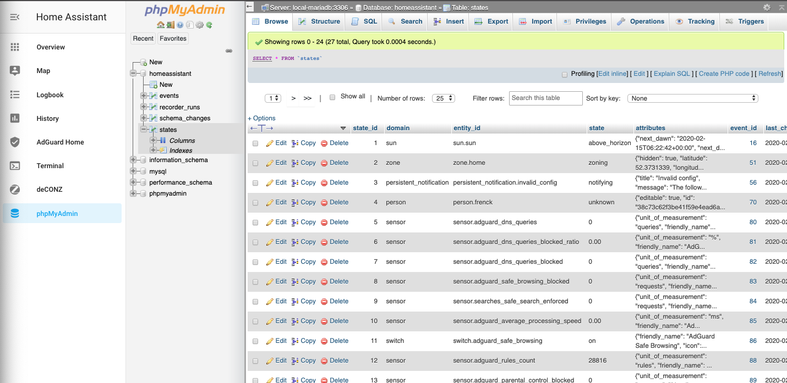

# Home Assistant Add-on: "Unofficial" phpMyAdmin

[![GitHub Release][releases-shield]][releases]
![Project Stage][project-stage-shield]
[![License][license-shield]](LICENSE.md)

![Supports aarch64 Architecture][aarch64-shield]
![Supports amd64 Architecture][amd64-shield]

[![Github Actions][github-actions-shield]][github-actions]
![Project Maintenance][maintenance-shield]
[![GitHub Activity][commits-shield]][commits]

A web interface for the official MariaDB add-on.

## About

This is a fork of the official phpMyAdmin add-on, made for testing stuff. Do not use, as this can break at any time.
phpMyAdmin is a database administration tool for MySQL & MariaDB. Frequently
used operations (managing databases, tables, columns, relations, indexes,
users, permissions, etc) can be performed via the user interface,
while you still have the ability to directly execute any SQL statement.

This add-on was specifically designed to manage the official Home Assistant
MariaDB add-on.

[:books: Read the full add-on documentation][docs]

## Support

Got questions?

You could [open an issue here][issue] GitHub.

## License

MIT License

Copyright (c) 2019-2025 Erik Hilton

Permission is hereby granted, free of charge, to any person obtaining a copy
of this software and associated documentation files (the "Software"), to deal
in the Software without restriction, including without limitation the rights
to use, copy, modify, merge, publish, distribute, sublicense, and/or sell
copies of the Software, and to permit persons to whom the Software is
furnished to do so, subject to the following conditions:

The above copyright notice and this permission notice shall be included in all
copies or substantial portions of the Software.

THE SOFTWARE IS PROVIDED "AS IS", WITHOUT WARRANTY OF ANY KIND, EXPRESS OR
IMPLIED, INCLUDING BUT NOT LIMITED TO THE WARRANTIES OF MERCHANTABILITY,
FITNESS FOR A PARTICULAR PURPOSE AND NONINFRINGEMENT. IN NO EVENT SHALL THE
AUTHORS OR COPYRIGHT HOLDERS BE LIABLE FOR ANY CLAIM, DAMAGES OR OTHER
LIABILITY, WHETHER IN AN ACTION OF CONTRACT, TORT OR OTHERWISE, ARISING FROM,
OUT OF OR IN CONNECTION WITH THE SOFTWARE OR THE USE OR OTHER DEALINGS IN THE
SOFTWARE.

[aarch64-shield]: https://img.shields.io/badge/aarch64-yes-green.svg
[amd64-shield]: https://img.shields.io/badge/amd64-yes-green.svg
[commits-shield]: https://img.shields.io/github/commit-activity/y/erik73/addon-phpmyadmin.svg
[commits]: https://github.com/erik73/addon-phpmyadmin/commits/main
[contributors]: https://github.com/erik73/addon-phpmyadmin/graphs/contributors
[discord-ha]: https://discord.gg/c5DvZ4e
[discord-shield]: https://img.shields.io/discord/478094546522079232.svg
[discord]: https://discord.me/hassioaddons
[docs]: https://github.com/erik73/addon-phpmyadmin/blob/main/phpmyadmin/DOCS.md
[forum-shield]: https://img.shields.io/badge/community-forum-brightgreen.svg
[forum]: https://community.home-assistant.io/t/home-assistant-community-add-on-phpmyadmin/171729?u=frenck
[frenck]: https://github.com/frenck
[github-actions-shield]: https://github.com/erik73/addon-phpmyadmin/workflows/CI/badge.svg
[github-actions]: https://github.com/erik73/addon-phpmyadmin/actions
[github-sponsors-shield]: https://frenck.dev/wp-content/uploads/2019/12/github_sponsor.png
[github-sponsors]: https://github.com/sponsors/frenck
[i386-shield]: https://img.shields.io/badge/i386-no-red.svg
[issue]: https://github.com/erik73/addon-phpmyadmin/issues
[keepchangelog]: http://keepachangelog.com/en/1.0.0/
[license-shield]: https://img.shields.io/github/license/erik73/addon-phpmyadmin.svg
[maintenance-shield]: https://img.shields.io/maintenance/yes/2025.svg
[patreon-shield]: https://frenck.dev/wp-content/uploads/2019/12/patreon.png
[patreon]: https://www.patreon.com/frenck
[project-stage-shield]: https://img.shields.io/badge/project%20stage-experimental-yellow.svg
[python-packages]: https://pypi.org/
[reddit]: https://reddit.com/r/homeassistant
[releases-shield]: https://img.shields.io/github/release/erik73/addon-phpmyadmin.svg
[releases]: https://github.com/erik73/addon-phpmyadmin/releases
[repository]: https://github.com/erik73/repository
